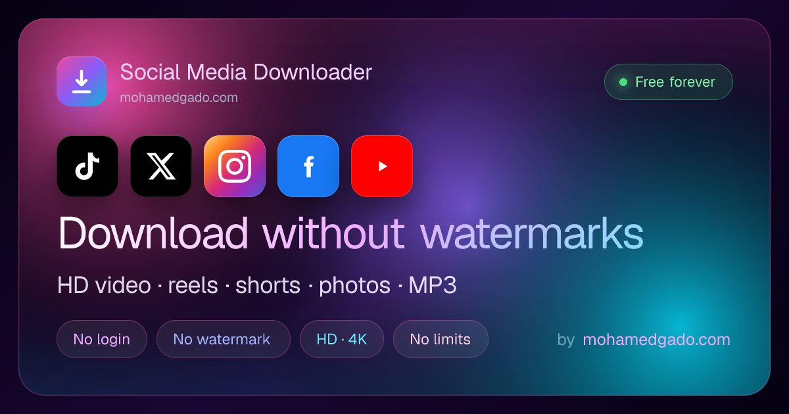
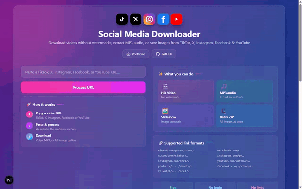

# Social Media Downloader

> Download TikTok, Twitter/X, Instagram, Facebook & YouTube videos without watermarks — HD video, reels, Shorts, MP3 audio, photo carousels, and ffmpeg-rendered slideshow MP4s. Free, no login, no limits.



[](https://nextjs.org)
[](https://react.dev)
[](https://www.typescriptlang.org)
[](https://tailwindcss.com)
[](LICENSE)

### 🚀 [Try it live →](https://www.socialdownloader.space)



A free, watermark-free downloader for TikTok, Twitter/X, Instagram, Facebook, and YouTube. Paste a link and get an HD video, reel, or Short, MP3 audio, a photo carousel (individual images or a ZIP), or a fully rendered slideshow MP4 with the original soundtrack — no login, no install, runs in your browser.

A free, open-source alternative to SnapTik, SSSTik, SaveTT, SnapInsta, Y2mate, and GetFvid — with no ads, no tracking, and a multi-source fallback chain so downloads keep working when any single provider goes down.

⭐ **If this tool is useful to you, please [star the repo](https://github.com/Vette1123/social-media-downloader/stargazers)** — it helps others find it.

Built with Next.js 16, React 19, TypeScript, Tailwind CSS 4, and Motion by [Mohamed Gado](https://www.mohamedgado.com).

## Features

**TikTok**

- HD video downloads without the watermark
- Extract the soundtrack as MP3 (re-served with `audio/mpeg`)
- Photo carousels (slideshows): preview every image, save individually or as a ZIP, keep the original background music
- Render a TikTok slideshow into a real MP4 video (ffmpeg) when the platform only ships images

**Twitter / X**

- Native video extraction from any `twitter.com` or `x.com` status URL

**Instagram**

- Download reels and feed videos in their original quality
- Save single-photo posts and multi-image carousels — individually or as a ZIP
- Extract the audio track from a reel as MP3
- Works with `instagram.com/p/…`, `/reel/…`, `/tv/…` and share links — no login required

**YouTube**

- Download videos and Shorts in HD as MP4
- Extract the audio track as MP3
- Rich metadata (title, channel, thumbnail) pulled from YouTube's public oEmbed
- Works with `youtube.com/watch?v=…`, `youtu.be/…`, `/shorts/…`, and `/embed/…`

**Facebook**

- Download public videos, watch clips, and reels in HD
- Extract the audio track as MP3
- Resolves `fb.watch/…` short links and `/share/…` links automatically
- Works with `facebook.com/…/videos/…`, `facebook.com/watch/?v=…`, and `facebook.com/reel/…`

**Quality of life**

- Inline video and image previews before downloading
- Multi-source fallback chain per platform (resilient against any single provider going down)
- CORS-proxied media routes so downloads (and Instagram's hotlink-protected CDN) work cross-origin
- Inline URL validation, smooth motion animations, fully responsive layout
- Production-grade SEO: dynamic OpenGraph and Twitter card images, JSON-LD (WebSite, Person, SoftwareApplication, HowTo, FAQPage), hreflang, sitemap, and a manifest tuned for PWA install
- No registration, no API keys, no daily limit

## Tech stack

| Layer            | Technology                          |
| ---------------- | ----------------------------------- |
| Framework        | Next.js 16 (App Router), React 19   |
| Language         | TypeScript 6                        |
| Styling          | Tailwind CSS 4                      |
| Animation        | Motion (formerly framer-motion) 12  |
| HTTP             | Axios                               |
| HTML scraping    | Cheerio                             |
| ZIP bundling     | JSZip                               |
| Slideshow video  | fluent-ffmpeg + @ffmpeg-installer   |
| Dynamic OG       | @vercel/og (edge runtime)           |
| Analytics        | Vercel Analytics                    |

## Getting started

**Prerequisites:** Node.js 20+ (24 LTS recommended), pnpm.

```bash
git clone https://github.com/Vette1123/social-media-downloader.git
cd social-media-downloader
pnpm install
pnpm dev
```

Open <http://localhost:3000>.

Build for production:

```bash
pnpm build && pnpm start
```

## How to use

**Download a video, reel, or Short**

1. Copy a TikTok, Twitter/X, Instagram, Facebook, or YouTube video URL.
2. Paste it into the input on the homepage.
3. Click **Process URL** — the app fetches metadata and a clean download link.
4. Optionally preview, then click **Video** or **Extract Audio**.

**Download a photo carousel**

1. Paste the photo post URL (a TikTok slideshow or an Instagram carousel).
2. All images appear as a selectable grid.
3. Toggle the selections, then download them individually or as a ZIP.
4. For TikTok slideshows, click **Video (slideshow)** to render an MP4 of the images timed to the original music.

**Supported URL formats**

| Platform  | Formats                                                                                                |
| --------- | ------------------------------------------------------------------------------------------------------ |
| TikTok    | `tiktok.com/@user/video/…`, `vm.tiktok.com/…`, `vt.tiktok.com/…`, `m.tiktok.com/v/…`, `tiktok.com/t/…` |
| Twitter/X | `twitter.com/user/status/…`, `x.com/user/status/…`, `t.co/…`                                           |
| Instagram | `instagram.com/p/…`, `instagram.com/reel/…`, `instagram.com/tv/…`, `instagram.com/share/…`             |
| YouTube   | `youtube.com/watch?v=…`, `youtu.be/…`, `youtube.com/shorts/…`, `youtube.com/embed/…`                   |
| Facebook  | `facebook.com/…/videos/…`, `facebook.com/watch/?v=…`, `facebook.com/reel/…`, `fb.watch/…`              |

## Project structure

```
src/
├── app/
│   ├── page.tsx                 # Home page (useReducer + motion)
│   ├── layout.tsx               # Root layout, metadata, JSON-LD injection
│   ├── opengraph-image.tsx      # Dynamic 1200x630 OG image (edge runtime)
│   ├── twitter-image.tsx        # Twitter card image (delegates to OG)
│   ├── robots.ts                # robots.txt (incl. AI crawler policy)
│   ├── sitemap.ts               # sitemap.xml with hreflang + OG image
│   ├── globals.css
│   └── api/
│       ├── download/            # POST — resolves URL, returns video/image data
│       ├── video/               # GET  — proxies the video stream (video/mp4)
│       ├── audio/               # GET  — proxies the same stream as audio/mpeg
│       ├── image/               # GET  — proxies a single image (CORS + CDN referer)
│       ├── images/              # POST — batch image fetcher with ZIP support
│       └── slideshow/           # POST — renders an MP4 from images + audio (ffmpeg)
├── components/
│   ├── icons.tsx
│   ├── ImageLightbox.tsx
│   └── ui/accordion.tsx
├── config/
│   └── site.ts                  # Single source of truth for site metadata
└── lib/
    ├── downloader.ts            # Core logic: TikTok + Twitter/X + Instagram + YouTube + Facebook fallbacks
    ├── validator.ts             # URL validation and platform detection
    ├── proxyHeaders.ts          # Per-CDN Referer resolution shared by the proxy routes
    ├── appReducer.ts            # Client state machine
    ├── audioExtractor.ts        # Audio extraction helpers
    ├── videoProcessor.ts        # Video processing utilities
    ├── structuredData.ts        # JSON-LD graph (Schema.org)
    ├── types.ts                 # Shared TypeScript types
    └── utils.ts
```

## API reference

### `POST /api/download`

Resolves a TikTok, Twitter/X, Instagram, Facebook, or YouTube URL and returns download links and metadata.

```json
{ "url": "https://www.instagram.com/reel/ABC123/" }
```

Video response:

```json
{
  "success": true,
  "downloadUrl": "/api/video?url=...",
  "audioUrl": "/api/audio?url=...",
  "metadata": { "title": "…", "author": "…", "thumbnail": "…", "platform": "instagram" }
}
```

Photo carousel response:

```json
{
  "success": true,
  "metadata": {
    "title": "…",
    "author": "…",
    "platform": "instagram",
    "images": ["…", "…"]
  }
}
```

### `GET /api/video?url=<encoded>`

Proxies a video file with `Content-Type: video/mp4`, adding the correct `Referer` for TikTok / Tikwm / Twitter / Instagram / Facebook / YouTube CDNs (via `lib/proxyHeaders.ts`) and honoring HTTP range requests so preview/seek works.

### `GET /api/audio?url=<encoded>`

Same proxy as `/api/video` but with `Content-Type: audio/mpeg`, so browsers treat it as an audio download.

### `GET /api/image?url=<encoded>`

Proxies a single image with the correct CDN `Referer` and permissive CORS headers. Instagram's CDN refuses cross-origin browser requests, so Instagram image previews and individual downloads are routed through this endpoint.

### `POST /api/images`

Fetches a list of image URLs. Returns either a JSON list of (proxied) downloadable URLs or a ZIP archive depending on `asZip`.

```json
{ "imageUrls": ["https://…"], "title": "post-title", "asZip": true }
```

### `POST /api/slideshow`

Renders a real MP4 from a TikTok photo carousel using ffmpeg, timing each image and laying the original music on top.

```json
{
  "imageUrls": ["https://…", "https://…"],
  "audioUrl": "https://…",
  "perImageSeconds": 3
}
```

## Source fallback order

The downloader tries providers in order and falls back automatically on failure.

- **TikTok videos:** Tikwm → Snaptik → SSSTik → direct scraping
- **Twitter/X videos:** vxTwitter → public Cobalt instances
- **Instagram posts/reels:** embed page (`shortcode_media`) → public Cobalt instances → web GraphQL
- **YouTube videos/Shorts:** public Cobalt instances → public Piped instances (metadata enriched via YouTube oEmbed)
- **Facebook videos/reels:** video plugin page (`/plugins/video.php`) → direct page scrape (`browser_native_*_url`) → public Cobalt instances

## Deployment

The project deploys to [Vercel](https://vercel.com/new) with no configuration. It runs on any Node.js host that supports Next.js 16 (Node 20+, ideally 24 LTS).

`@vercel/og` requires the edge runtime; the OG and Twitter card routes are already configured for it.

## Legal

This tool is intended for personal use with content you have the right to save. Respect the Terms of Service of TikTok, Twitter/X, Instagram, Facebook, and YouTube, and do not download content without the creator's permission. Private accounts, stories, and age-restricted, members-only, or private videos are not supported.

## Author

Built and maintained by **[Mohamed Gado](https://www.mohamedgado.com)** — [mohamedgado.com](https://www.mohamedgado.com).

## License

MIT — see [LICENSE](LICENSE).

## Issues and contributions

Open a ticket on the [Issues](../../issues) page with a description, the URL format you tried, and any error message. Pull requests welcome.
